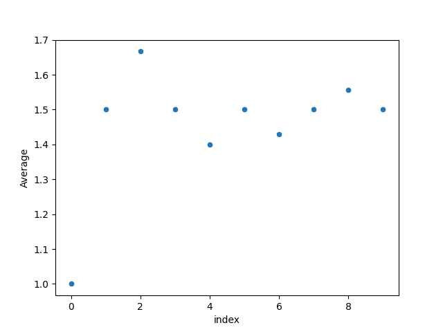
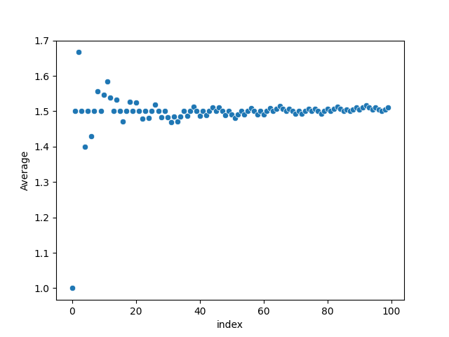
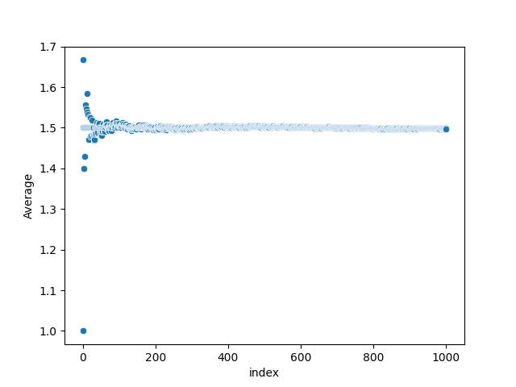

# kolakoski-sequence
This script, which was partially adapted from the script `kolakoski.py` from [this repository](https://github.com/w4jbm/Kolakoski-Sequence.git), generates the [Kolakoski sequence](https://www.youtube.com/watch?v=co5sOgZ3XcM) and shows that the average of the first $n$ numbers tends to $\frac{3}{2}$ as $n \to \infty$. 

# Seaborn plots
A scatterplot of the first 10 averages:

A scatterplot of the first 100 averages:

A scatterplot of the first 1000 averages:
